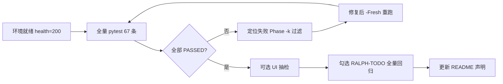

# 全量 US 回归检查清单

面向 `tests/api/test_user_stories_smoke.py` 的 **66 条 US 烟测 + 1 条 health**，按 Phase 串行验收。与 [RALPH-TODO.md](./RALPH-TODO.md) 顶层「全量 US 回归验收」对应。

---

## 1. 验收标准（Exit Criteria）

| 项 | 要求 |
|----|------|
| API 烟测 | `pytest tests/api/test_user_stories_smoke.py -v` **全部 PASSED** |
| 用例数量 | **67**（`test_health` + 66 × `test_us_*`） |
| 执行方式 | **串行、单进程**（禁止 `pytest-xdist`） |
| 数据依赖 | 用例共享 `ST` 状态，**必须按文件顺序**执行 |
| 干净库 | 首次或遇唯一约束冲突时加 `-Fresh` / `init_db.py` 重建 |

---

## 2. 注意事项

### 2.1 执行纪律（必守）

- **禁止并行：** 不得使用 `pytest-xdist` 或多进程跑 `test_user_stories_smoke.py`。
- **必须串行：** 67 条用例共享文件内状态对象 `ST`，**必须按 `test_user_stories_smoke.py` 中的定义顺序**从头到尾执行。
- **`-k` 过滤：** 仅用于定位失败 Phase；过滤后仍按文件顺序跑匹配项。**不要只跑某个 Phase 的后半段**（例如单独跑 `test_us_401_2` 而不跑前面的 `test_us_401_1`）。
- **API 地址：** 默认 `http://127.0.0.1:8000`；Docker/Nginx 场景通过 `XIJIU_API_BASE` 指定（见 `run-us-tests.ps1`）。
- **干净库：** 首次全量回归、或出现唯一约束 / 脏数据导致随机失败时，务必 `init_db.py` 或 `.\scripts\run-us-tests.ps1 -Fresh` 后再跑。

### 2.2 验收范围说明

- 本清单验收的是 **API 层 US 烟测**（`tests/api/test_user_stories_smoke.py`），**不是** E2E Playwright（`tests/e2e/` 为可选补充）。
- Phase 矩阵中的 **「可选 UI 抽检」** 不替代 pytest；仅在 API 全绿后按需人工点验页面。
- **不要在未实际跑通 pytest 的情况下** 对外宣称「全量 US 已通过」。

### 2.3 全部通过后的必做事项

仅在 **`pytest tests/api/test_user_stories_smoke.py -v` 显示 67 passed** 时执行：

1. **填写回归记录** — 使用本文 [§8 回归记录模板](#8-回归记录模板)，保存日期、环境、命令、结果。
2. **勾选 RALPH-TODO** — 打开 [RALPH-TODO.md](./RALPH-TODO.md)，将顶层  
   `- [ ] 全量 US 回归验收`  
   改为  
   `- [x] 全量 US 回归验收`（可附执行日期与 `67 passed`）。
3. **更新 README 声明** — 打开 [README.md](../README.md) 中 **「全量 US 测试结果」** 小节：
   - 将表格日期更新为**实际跑通日期**（勿沿用旧日期）；
   - 确认 Phase 1~4、US-501 行仍为「✅ 全部通过」且与本次 pytest 结果一致；
   - 若 Phase 3/4 曾修复 P0 端点，README 的 API 清单应与当前 `backend/app/api/*` 一致（可参考 [REPO-REVIEW-2026-07-05.md](./REPO-REVIEW-2026-07-05.md)）。
4. **（可选）** 同步 [AGENTS.md](../AGENTS.md) 功能矩阵状态，与 RALPH-TODO 保持一致。

### 2.4 未通过或部分通过时

- **不要** 勾选 RALPH-TODO「全量 US 回归验收」。
- **不要** 将 README 写成「全量 US 全部通过」。
- 记录**首个失败用例**与 traceback → 按 Phase `-k` 复现 → 修复后 **`-Fresh` 全量重跑**（避免 `ST` 半途中断导致误判）。

### 2.5 提交与协作

- 代码修复与文档更新（RALPH-TODO / README）可分开 commit；文档更新建议在 pytest 绿屏**之后**再提交。
- 推送远程前建议本地或 CI 再跑一遍全量烟测，防止环境差异导致误报。

---

## 3. 环境准备

### 方式 A：本地开发（SQLite，推荐调试）

```powershell
cd backend
python -m pip install -r requirements.txt
python init_db.py
uvicorn app.main:app --host 127.0.0.1 --port 8000
```

另开终端：

```powershell
cd <项目根>
python -m pip install -r requirements-dev.txt
$env:XIJIU_API_BASE = "http://127.0.0.1:8000"
python -m pytest tests/api/test_user_stories_smoke.py -v --tb=short
```

### 方式 B：Docker 一键（演示/CI 近似）

```powershell
.\scripts\run-us-tests.ps1 -Fresh
```

经 Nginx 反代验证：

```powershell
.\scripts\run-us-tests.ps1 -Fresh -ThroughNginx
```

Linux/macOS：`./scripts/run-us-tests.sh [--fresh] [--nginx]`

### 前置检查

- [ ] `curl http://127.0.0.1:8000/health` 返回 `{"status":"healthy"}`
- [ ] 已安装 `httpx`、`pytest`（见 `requirements-dev.txt`）
- [ ] 未设置会干扰的 `pytest-xdist` / 并行插件
- [ ] 数据库为种子数据或 `-Fresh` 后的干净库

---

## 3. 执行命令速查

| 场景 | 命令 |
|------|------|
| **全量回归** | `pytest tests/api/test_user_stories_smoke.py -v --tb=short` |
| Phase 1 | `pytest ... -v -k "test_us_10"` |
| Phase 2 | `pytest ... -v -k "test_us_20"` |
| Phase 3 | `pytest ... -v -k "test_us_30"` |
| Phase 4 | `pytest ... -v -k "test_us_40"` |
| US-501 | `pytest ... -v -k "test_us_501"` |
| 单条 | `pytest ... -v -k "test_us_401_1"` |

> `-k` 过滤仍按文件顺序跑匹配项；Phase 内子用例有 `ST` 依赖，不要只跑后半段。

---

## 4. Phase 回归矩阵

状态列用于人工勾选；自动化以 pytest 结果为准。

### Phase 1：供应商准入（18 用例）

| 用例 | US | 角色 | 关键 API / 断言要点 |
|------|-----|------|---------------------|
| [ ] `test_us_101_1` | 101-1 | 采购 | `POST /supplier-portal/invitations` |
| [ ] `test_us_101_2` | 101-2 | 供应商 | `GET /supplier-portal/invitations?email=` |
| [ ] `test_us_102_1` | 102-1 | 供应商 | `POST /register` |
| [ ] `test_us_102_2` | 102-2 | 采购 | `GET /register/pending-audit` |
| [ ] `test_us_103_1` | 103-1 | 采购 | 审批通过/驳回 |
| [ ] `test_us_103_2` | 103-2 | 供应商 | `POST /register/resubmit` |
| [ ] `test_us_104_1` | 104-1 | 采购 | `POST /qualification/projects` |
| [ ] `test_us_104_2` | 104-2 | 供应商 | `GET /qualification/projects?supplier_id=` |
| [ ] `test_us_105_1` | 105-1 | 供应商 | 问卷 `POST .../submission` |
| [ ] `test_us_105_2` | 105-2 | 采购 | `GET .../submissions/{supplier_id}` |
| [ ] `test_us_106_1` | 106-1 | 采购 | 评审打分/澄清 |
| [ ] `test_us_106_2` | 106-2 | 供应商 | 查看评审结果 |
| [ ] `test_us_107_1` | 107-1 | 采购 | 最终批准/拒绝 |
| [ ] `test_us_107_2` | 107-2 | 供应商 | 查看最终决定 |
| [ ] `test_us_108_1` | 108-1 | 采购 | 资质预警/重认证邀请 |
| [ ] `test_us_108_2` | 108-2 | 供应商 | 查看预警与邀请 |
| [ ] `test_us_109_1` | 109-1 | 供应商 | 资质更新/重认证材料 |
| [ ] `test_us_109_2` | 109-2 | 采购 | 查看资质更新记录 |

**可选 UI 抽检：** `/buyer/invitations` → `/supplier/registration` → `/buyer/qualifications` → `/supplier/qualifications`

---

### Phase 2：寻源与合同（16 用例）

| 用例 | US | 角色 | 关键 API |
|------|-----|------|----------|
| [ ] `test_us_201_1` | 201-1 | 采购 | `POST /sourcing/` |
| [ ] `test_us_201_2` | 201-2 | 供应商 | `GET /sourcing/` |
| [ ] `test_us_202_1` | 202-1 | 供应商 | accept/decline 邀请 |
| [ ] `test_us_202_2` | 202-2 | 采购 | 查看邀请响应 |
| [ ] `test_us_203_1` | 203-1 | 采购 | 授标 |
| [ ] `test_us_203_2` | 203-2 | 供应商 | 查看中标/落标 |
| [ ] `test_us_204_1` | 204-1 | 采购 | 合同草案 |
| [ ] `test_us_204_2` | 204-2 | 供应商 | 查看草案 |
| [ ] `test_us_205_1` | 205-1 | 供应商 | 修改意见 |
| [ ] `test_us_205_2` | 205-2 | 采购 | 查看意见 |
| [ ] `test_us_206_1` | 206-1 | 采购 | 发起签署 |
| [ ] `test_us_206_2` | 206-2 | 供应商 | 签署 |
| [ ] `test_us_207_1` | 207-1 | 供应商 | 签署状态 |
| [ ] `test_us_207_2` | 207-2 | 采购 | 签署状态 |
| [ ] `test_us_208_1` | 208-1 | 采购 | 修改合同状态 |
| [ ] `test_us_208_2` | 208-2 | 供应商 | 查看状态变更 |

**可选 UI 抽检：** `/buyer/sourcing` → `/supplier/invitations` → `/buyer/contracts`

---

### Phase 3：预测与订单执行（20 用例）

| 用例 | US | 角色 | 关键 API / 状态流 |
|------|-----|------|-------------------|
| [ ] `test_us_301_1` | 301-1 | 采购 | `POST /collaboration/forecasts` + publish |
| [ ] `test_us_301_2` | 301-2 | 供应商 | `GET /collaboration/forecasts` |
| [ ] `test_us_302_1` | 302-1 | 供应商 | `POST .../responses` |
| [ ] `test_us_302_2` | 302-2 | 采购 | `GET .../responses` |
| [ ] `test_us_303_1` | 303-1 | 采购 | `POST /purchase-orders/` |
| [ ] `test_us_303_2` | 303-2 | 供应商 | `POST .../supplier-confirm` |
| [ ] `test_us_304_1` | 304-1 | 采购 | 订单 cancel |
| [ ] `test_us_304_2` | 304-2 | 供应商 | 查看 cancel 状态 |
| [ ] `test_us_305_1` | 305-1 | 采购 | `POST /collaboration/delivery-schedules` |
| [ ] `test_us_305_2` | 305-2 | 供应商 | 查看要货计划 |
| [ ] `test_us_306_1` | 306-1 | 供应商 | supplier-confirm → `confirmed` |
| [ ] `test_us_306_2` | 306-2 | 采购 | 查看已确认计划 |
| [ ] `test_us_307_1` | 307-1 | 供应商 | ASN 创建 → `draft` |
| [ ] `test_us_307_2` | 307-2 | 采购 | 列表含 ASN |
| [ ] `test_us_308_1` | 308-1 | 采购 | submit → approve → `approved` |
| [ ] `test_us_308_2` | 308-2 | 供应商 | 详情 status=approved |
| [ ] `test_us_309_1` | 309-1 | 供应商 | `POST .../packing-lists` |
| [ ] `test_us_309_2` | 309-2 | 采购 | `GET .../packing-lists` |
| [ ] `test_us_310_1` | 310-1 | 采购 | `POST /logistics/receipts/` |
| [ ] `test_us_310_2` | 310-2 | 供应商 | 查看收货 |

**P0 回归重点：** `/collaboration/*` 可达、`/logistics/.../submit|approve|packing-lists` 存在。

**可选 UI 抽检：** `/buyer/forecast` → `/supplier/capacity` → `/buyer/financial` 前的 `/buyer/delivery-plans`、`/supplier/asn`

---

### Phase 4：财务结算（10 用例）

| 用例 | US | 角色 | 关键 API / 状态流 |
|------|-----|------|-------------------|
| [ ] `test_us_401_1` | 401-1 | 供应商 | `POST /financial/statements/?submit=true` → `pending_audit` |
| [ ] `test_us_401_2` | 401-2 | 采购 | `POST .../buyer-audit` approve → `confirmed` |
| [ ] `test_us_402_1` | 402-1 | 供应商 | `PUT .../statements/{id}?submit=true` |
| [ ] `test_us_402_2` | 402-2 | 采购 | 再次 buyer-audit |
| [ ] `test_us_403_1` | 403-1 | 供应商 | `POST /financial/invoices/` |
| [ ] `test_us_403_2` | 403-2 | 采购 | three-way-match + approve → `verified` |
| [ ] `test_us_404_1` | 404-1 | 供应商 | reject → resubmit |
| [ ] `test_us_404_2` | 404-2 | 采购 | 查看重提发票 |
| [ ] `test_us_405_1` | 405-1 | 采购 | `POST /financial/payments/` |
| [ ] `test_us_405_2` | 405-2 | 供应商 | `GET /financial/payments/?supplier_id=` |

**可选 UI 抽检：** `/buyer/financial`（结算审核/三单匹配/付款）→ `/supplier/settlements` → `/supplier/invoices`

---

### US-501：公告栏（2 用例）

| 用例 | US | 角色 | 关键 API |
|------|-----|------|----------|
| [ ] `test_us_501_1` | 501-1 | 采购 | `POST /announcements/` |
| [ ] `test_us_501_2` | 501-2 | 供应商 | GET 详情 + `record-read` + `/types/summary` |

**回归重点：** `GET /announcements/types/summary` 不能 422（路由须在 `/{id}` 之前）。

**可选 UI 抽检：** `/buyer/announcements` → `/supplier/announcements`

---

## 5. 推荐执行顺序



1. **Smoke：** `test_health`
2. **Phase 1 → 2 → 3 → 4 → 501**（文件默认顺序，勿打乱）
3. **失败时：** 记录首个失败用例名 → 用 `-k` 从 Phase 起点重跑（或 `-Fresh` 全量重跑）
4. **通过后：** 勾选 RALPH-TODO、按需跑 E2E（`tests/e2e/`，非 US 矩阵必需）

---

## 6. 常见问题

| 现象 | 可能原因 | 处理 |
|------|----------|------|
| 404 on `/collaboration/*` | router 未挂载 | 检查 `main.py` 含 `collaboration.router` |
| 404 on `packing-lists` / `submit` | logistics 端点缺失 | 检查 `logistics.py` US-308/309 |
| 422 on `/announcements/types/summary` | 路由顺序 | `types/summary` 须在 `/{id}` 前 |
| 409 / UNIQUE 约束 | 旧库脏数据 | `init_db.py` 或 `-Fresh` |
| 前面过、后面挂 | 并行跑或跳过用例 | 禁用 xdist，全文件串行 |
| Phase 4 三单匹配 fail | 发票金额 > 结算单 | 检查 `three-way-match` 逻辑 |

---

## 7. 回归记录模板

```
日期：
执行人：
环境：本地 SQLite / Docker / Nginx
命令：
结果：67 passed / __ failed
失败用例：
根因：
修复 commit：
复验：
```

---

## 8. 相关文档

- 用户故事定义：[US.txt](./US.txt)
- Ralph 进度：[RALPH-TODO.md](./RALPH-TODO.md)
- 仓库审查：[REPO-REVIEW-2026-07-05.md](./REPO-REVIEW-2026-07-05.md)
- 测试说明：[tests/api/README.md](../tests/api/README.md)
